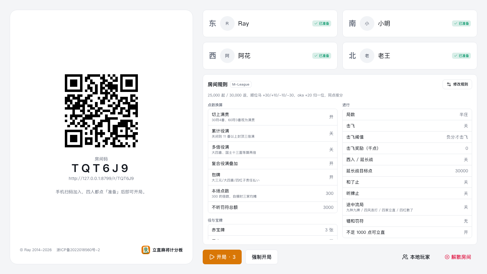
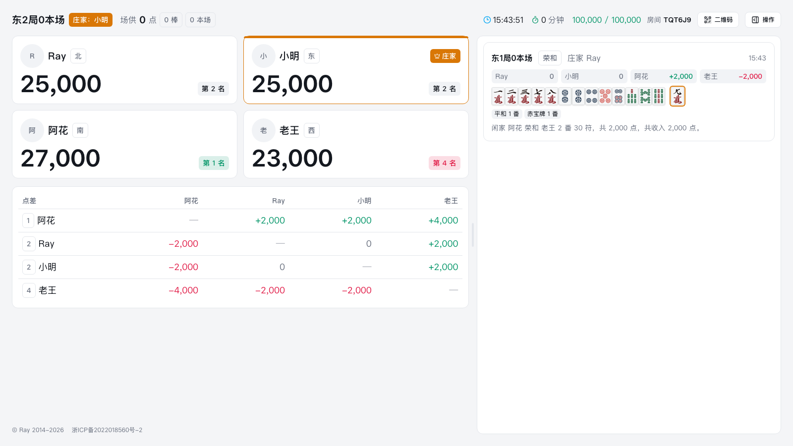
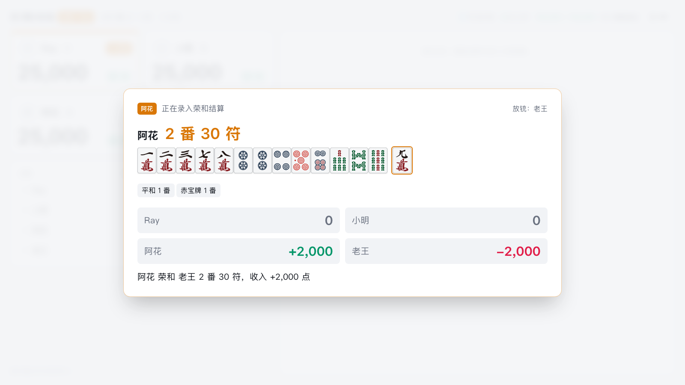
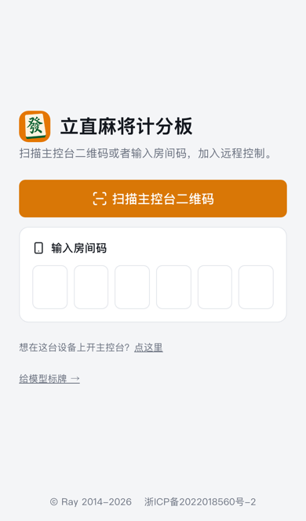
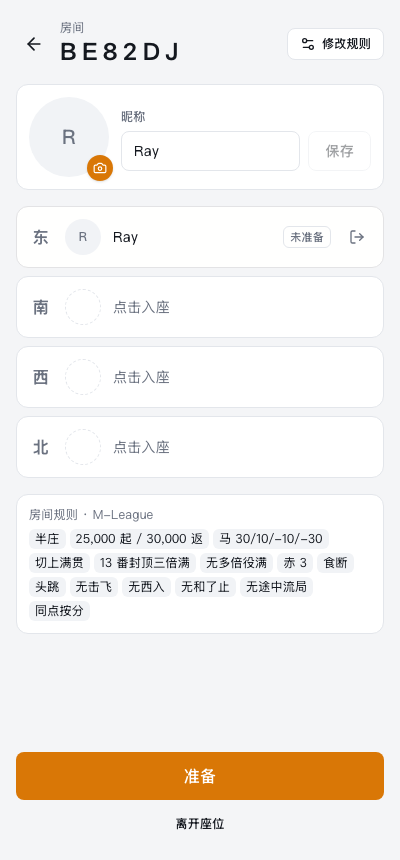
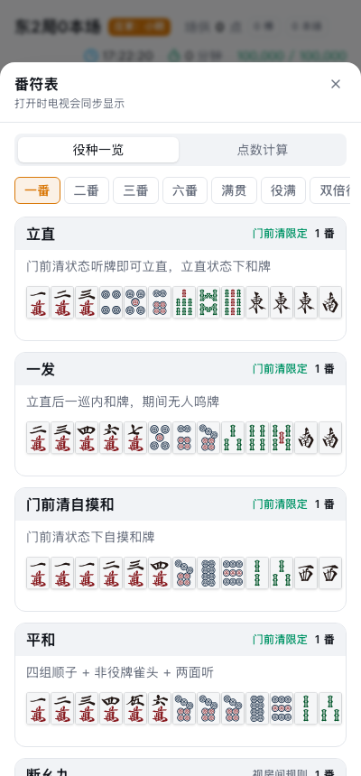
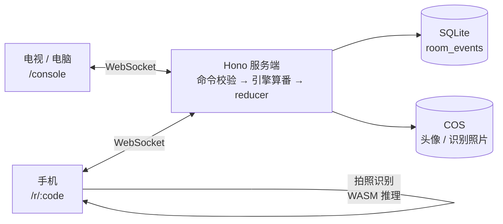

<p align="center">
  
</p>

<h1 align="center">立直麻将计分板</h1>

<p align="center">
  电视显示房间二维码，手机扫码入座，四个人各自在手机上记分、算番，所有屏幕实时同步
</p>

<p align="center">
  🌐 <a href="https://riichi.ruivon.cn"><strong>riichi.ruivon.cn</strong></a> · 电脑或电视打开就是主控台，手机打开就是加入页
</p>

<p align="center">
  <a href="#-亮点">亮点</a> ·
  <a href="#-界面">界面</a> ·
  <a href="#-怎么用">怎么用</a> ·
  <a href="#-架构">架构</a> ·
  <a href="#-快速开始">快速开始</a> ·
  <a href="#-文档">文档</a>
</p>

<p align="center">
  
  
  
  
  
  
  
  
</p>

> 打日麻时最麻烦的是算点：谁和了、几番几符、本场和供托怎么分，往往要翻表、口算、再挨个传点棒。这个计分板把这些交给程序。电视或平板当主控台，摆在牌桌旁显示四家点数和历史；每个人用自己的手机录入和牌，番符由服务端的引擎算，结果同时出现在所有屏幕上。牌型可以拍照识别，村规可以按房间配置。

---

## ✨ 亮点

- **电视加手机的遥控模式**：主控台只负责显示，操作都在手机上。手机上正在录入的结算会实时镜像到电视上，全桌一起核对。没带手机的玩家，可以由主控台添加为「本地玩家」代为操作。
- **拍照识别手牌**：把手牌、副露和宝牌指示牌摆进取景带，连续三帧认出同一副牌就自动定格，牌面自动填好并算番。模型是自训的 YOLO11n，在手机浏览器里用 onnxruntime-web 推理，iPhone 15 上一帧不到 300 ms。
- **番符由引擎算，不靠手填**：录入牌面后，服务端用 `riichi-rs-node` 算出役种、番数和符数，历史记录里保留整副手牌与役种。也可以直接手填番符。
- **村规按房间配置**：内置 M-League（默认）、雀魂段位、天凤凤凰、最高位战、WRC 五套预设。切上满贯、累计役满、击飞、西入、包牌、本场点数等规则都可以单独调整。
- **断线不丢局**：房间事件溯源，每条命令都落进 SQLite。服务端重启后按事件回放恢复，撤销、重做随时可用。手机丢了登录状态，也能让离线的旧座位离座后重新坐回去。
- **番符表随手查**：役种一览和点数计算表按雀魂的结构排版，每个役种都附例牌。默认只在自己手机上看，想全桌一起看时打开「投到电视」。
- **立直音乐**：立直时选一首曲子，电视循环播放，结算时自动停止。按下立直同时记下本局立直，结算时自动勾上。
- **防手滑**：番符和放铳者不给默认值，确认键旁同屏显示「谁和了谁、收入多少」；结算弹窗关掉再开草稿还在，别人先记了一笔会自动关闭；撤销、重做全桌都能看到是谁撤了哪一笔。

## 📸 界面

### 电视 / 电脑主控台

<table>
  <tr>
    <td align="center" width="50%">
      
      <sub><b>大厅</b> · 房间二维码、四家座位、本房规则</sub>
    </td>
    <td align="center" width="50%">
      
      <sub><b>对局</b> · 四家点数、点差表、带牌面与役种的历史</sub>
    </td>
  </tr>
  <tr>
    <td align="center" width="50%">
      
      <sub><b>结算镜像</b> · 手机上正在录入的荣和同步到电视</sub>
    </td>
    <td align="center" width="50%">&nbsp;</td>
  </tr>
</table>

### 手机

<table>
  <tr>
    <td align="center" width="33%">
      
      <sub><b>加入</b> · 扫码或输入六位房间码</sub>
    </td>
    <td align="center" width="33%">
      
      <sub><b>入座</b> · 选座、准备，四人就绪自动开局</sub>
    </td>
    <td align="center" width="33%">
      
      <sub><b>番符表</b> · 按番数分组，附例牌</sub>
    </td>
  </tr>
</table>

## 🀄 怎么用

1. 电视、电脑或平板打开 [riichi.ruivon.cn](https://riichi.ruivon.cn)，会自动建好房间并显示二维码。
2. 四个人用手机扫码，填昵称、选座、点「准备」。四人都准备好后，3 秒倒计时自动开局。
3. 有人和牌，就在手机上点「荣和」（再选放铳者）或「自摸」，录入牌面（或点「拍照识别」）。确认后，所有屏幕上的点数同步更新。
4. 流局、途中流局、错和、调整场况也在同一个面板里（主控台点右上角「操作」打开）；记错了可以撤销上一次操作。

拍照识别的摆法：

- 暗牌连着排，**和张横放**在一端；
- 副露每组 3 或 4 张，其中一张横放（暗杠摆成牌背-X-X-牌背），放在右侧、上方、下方都可以；
- 宝牌指示牌全部正放在手牌上方，两行时上面一行是表宝牌、下面一行是里宝牌，认出里宝牌会自动勾上立直。

连续三帧认不齐时，可以随时按右下角快门手动定格。每次识别的定格照片和结算确认后的手牌会上传保存，用作模型的训练数据；每人每小时最多识别 60 次。首页的「拍照算点数」不进房间也能用：设好场风、自风、本场和规则，拍一手牌、核对识别结果，点「识别正确」就给出番符、役种和点数；确认的手牌同样用作训练数据。

> 可以把网页「添加到主屏幕」，全屏使用。不过 iOS 主屏应用和 Safari 各存一份登录状态，同一台手机在两边会被当成两个玩家。

## 🏛 架构



| 层                     | 组成                                                      | 职责                                                                                                                                       |
| ---------------------- | --------------------------------------------------------- | ------------------------------------------------------------------------------------------------------------------------------------------ |
| 领域层 `packages/core` | 纯 TypeScript                                             | 规则与预设、计分、局次推进、终局结算、`reduceRoom(state, event)` 纯函数 reducer、番符表数据、协议类型；前后端共用                          |
| 服务端 `apps/server`   | Hono + `@hono/node-ws` + `node:sqlite` + `riichi-rs-node` | 房间事件溯源：命令带 `baseSeq` 做并发控制，校验后补全身份与引擎结果，再经 reducer 写入 `room_events` 并广播；撤销/重做栈在内存里按回放重建 |
| 前端 `apps/web`        | Vite + React 19 + Tailwind v4 + Radix                     | `/` 按设备分流，`/console` 主控台，`/r/:code` 手机端，`/calc` 拍照算点数；识别推理在 Web Worker 里跑                                       |
| 模型 `ml/`             | Python + uv + Ultralytics                                 | 公开数据集加合成场景训练 YOLO11n，导出内嵌 NMS 的 ONNX，发布到对象存储                                                                     |

## 🧰 技术栈

| 部分   | 选型                                                                                    |
| ------ | --------------------------------------------------------------------------------------- |
| 前端   | React 19、React Router、Zustand、Tailwind CSS v4、Radix UI、qr-scanner、onnxruntime-web |
| 服务端 | Node 24、Hono、WebSocket、`node:sqlite`、`riichi-rs-node`、腾讯云 COS SDK               |
| 测试   | Vitest 单测、Playwright 端到端（电视 + 多台手机 + 真实识别链路）                        |
| 部署   | Docker、GitHub Actions、腾讯云 COS + CDN + CCR                                          |

## 🚀 快速开始

需要 Node 24（最低 22.13）和 Corepack。

```bash
corepack enable
yarn install
yarn dev          # 服务端 :8787，前端 :5173
```

电脑浏览器打开 `http://localhost:5173` 就是主控台（`ci/dev-tls/certs/` 里有证书时自动改成 `https://`）；手机要扫码或拍照，需要 HTTPS，配置见 [本地开发](docs/development.md)。

```bash
yarn test         # 单测
yarn e2e          # 端到端
docker compose up -d --build   # 单容器运行，:8787
```

## 📚 文档

| 文档                                       | 内容                                                        |
| ------------------------------------------ | ----------------------------------------------------------- |
| [docs/development.md](docs/development.md) | 本地开发、常用命令、手机 HTTPS 调试（mkcert、开发机 caddy） |
| [docs/deployment.md](docs/deployment.md)   | 同源部署、线上 CI/CD、服务器与 secrets、PWA、曲库与模型发布 |
| [ml/README.md](ml/README.md)               | 牌面检测模型的数据、训练、导出与发布                        |
| [CLAUDE.md](CLAUDE.md)                     | 架构与领域概念的完整说明（协议、事件溯源、识别流水线细节）  |

## 致谢

- 牌图来自 [lietxia/mahjong_graphic](https://github.com/lietxia/mahjong_graphic)，见 [`apps/web/src/assets/tiles/NOTICE.md`](apps/web/src/assets/tiles/NOTICE.md)
- 番符计算使用 [riichi-rs-node](https://www.npmjs.com/package/riichi-rs-node)（[riichi-rust](https://github.com/MahjongPantheon/riichi-rust) 的 wasm 封装）

<p align="center"><sub>© <a href="https://r-ay.cn">Ray</a> 2014-present</sub></p>
